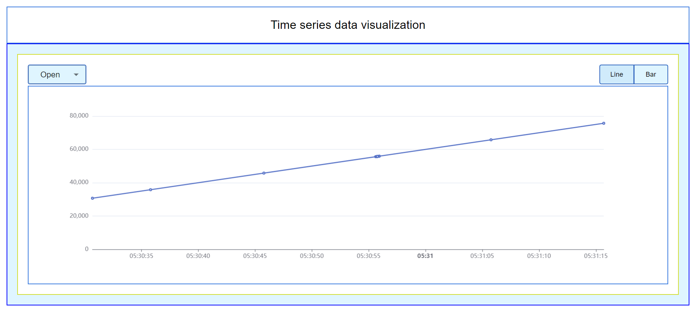
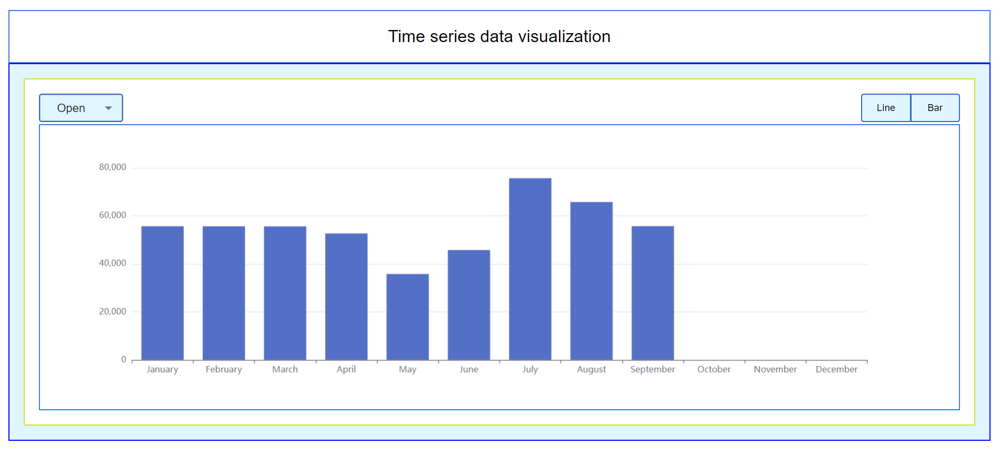

# Cryptocurrency Time Series Visualization

This project aims to visualize cryptocurrency time series data using React.js and Echarts.

## Requirements

- React.js based UI
- Echarts for React for chart rendering
- Dataset: [gemini_BTCUSD_2020_1min.csv](https://www.kaggle.com/datasets/roopahegde/cryptocurrency-timeseries-2020)
- Parent-child component structure
- Dropdown for column selection
- Toggle for chart type (line or bar)
- Dynamically updating canvas based on selections

## Approach

## Set Up React.js UI: 
Create a React.js project if you haven't already. You can use tools like Create React App for this purpose. Set up your project structure and install necessary dependencies.

## Integrate Echarts: 
Use the echarts-for-react package to integrate Echarts into your React application. This package provides components to easily render Echarts charts within React components.

## Fetch and Preprocess Data: 
Fetch the cryptocurrency time series dataset, specifically the gemini_BTCUSD_2020_1min.csv file. You can use libraries like axios for making HTTP requests. Preprocess the data as needed, including reducing the data size if required.

## Parent-Child Component Structure: 
Create a parent component responsible for handling data initialization and passing it to child components. The child components will render the line chart and bar chart based on the data received from the parent.

## Dropdown for Column Selection: 
Implement a dropdown menu to select the column for visualization. Use options like Open, High, Low, Close, and Volume. Set the default option as the first one.

## Toggle for Chart Type: 
Implement a toggle button to switch between line chart and bar chart visualization. By default, the line chart should be enabled.

## Rendering Charts: 
Based on the selected column and chart type, render the appropriate Echarts visualization. For line charts, use continuous data, and for bar charts, you can bin the data by months and display the average value for each month.

## Update Canvas Dynamically: 
Ensure that the canvas is updated dynamically whenever there is a change in the selected column or chart type.

## Styling: 
Style your components as per your design requirements using CSS. You can use any CSS frameworks or libraries as per your preference.

##  Output :

1. Line chart :

2. Bar chart :

